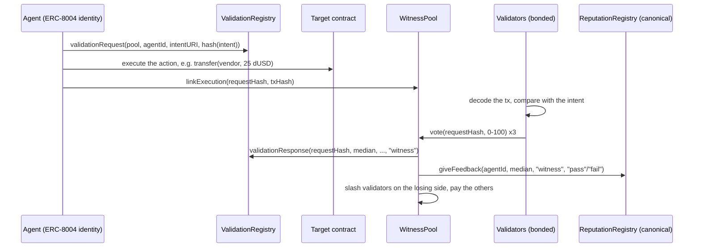

# Witness

**A validation protocol for ERC-8004 agents on Monad.** An agent commits what it is about to do on chain before doing it. Bonded validators check the transaction it then sends against that commitment, and the quorum's verdict is written to the ERC-8004 Validation Registry and to the agent's ERC-8004 reputation. Validators who vote against the quorum lose part of their bond.

- Live explorer: https://witness-8004.vercel.app (reads Monad testnet directly, no backend)
- Track: Metropolis Track 4, Trust, Identity & AI Infrastructure

## The problem

ERC-8004 gives agents an identity (Identity Registry) and a place to collect feedback (Reputation Registry). Its third piece, the Validation Registry, is how anyone is supposed to check an agent's work independently. On Monad that registry is still listed as "coming soon", and the spec leaves the actual protocol, meaning who validates, what they check and what happens when they lie, to "the specific validation protocol".

The gap matters most for agents that move money. Reputation built from client feedback reflects how an agent felt to its users, not whether a particular payment went where the agent said it would. A procurement agent can promise "pay ACME 25 dUSD for invoice #1118" and send 250 dUSD somewhere else, and nothing on chain connects the promise to the payment.

**Who it is for:** teams running agents that act on chain (payments, procurement, treasury ops) who want each action independently checked against what the agent declared, and anyone deciding whether to trust an agent they did not build.

## How it works



1. **Commit.** The agent builds an intent (target contract, function signature, arguments, max native value, expiry), canonicalizes it and calls the spec's `validationRequest`, naming the WitnessPool as `validatorAddress`. The intent travels inline as a `data:` URI, so validators need no extra storage service.
2. **Act and link.** The agent sends the transaction, then calls `WitnessPool.linkExecution`. Only the agent's owner or approved operator can link.
3. **Check.** Every validator independently fetches the transaction and runs `verifyExecution` (`sdk/intent.ts`): sender, target, function selector, decoded arguments, value, success, that the action landed after the commitment, and before expiry. Any mismatch caps the score at 20, below the pass line of 50. An intent with no linked execution by its expiry gets 0.
4. **Settle.** When `quorum` votes are in, the pool takes the median, writes it as the ERC-8004 `validationResponse`, and posts it as feedback on the **canonical** ERC-8004 Reputation Registry already deployed on Monad. Validators whose pass/fail vote disagrees with the verdict lose `slashBps` of their bond, split among the validators who agreed.

The explorer re-runs the same `verifyExecution` in the browser, so a reader can confirm any verdict without trusting the validators or this site.

## Why Monad

Validating every agent action, instead of sampling or batching, needs an onchain write per action that is cheap and final almost immediately. Batching hides which action went wrong and delays the slash.

Measured on Monad testnet with the demo below. The rogue payment went from commitment to quorum verdict in **17 blocks (about 5 seconds)**, of which the three validator votes plus settlement took about 2.5 seconds after the agent linked its transaction. That is fast enough to sit inside an agent's own loop. An agent, or the wallet it runs in, can wait for the verdict on step N before taking step N+1.

Monad-specific details the code depends on:

- `eth_getLogs` on the public RPC is limited to about 100 blocks, which at 0.4 s blocks is under a minute. The registry and pool record the block of each request, link and verdict, so clients fetch each event with a one-block log query instead of scanning history (`requestBlock`, `getRound`).
- Monad charges the gas **limit**, not gas used. The vote that completes the quorum also writes the validation response and the reputation feedback (about 540k gas against the canonical registry, measured), and any vote can be that one, so the node sends votes with a fixed 750k limit. That cost is per vote, which is part of why quorum size is a deploy parameter.

## Deployed contracts (Monad testnet, chain 10143)

| Contract | Address |
|---|---|
| ValidationRegistry (ERC-8004, this repo) | [`0x9F8fB7cEBA50f98283FEf1DE446fD169Be6a113f`](https://testnet.monadvision.com/address/0x9F8fB7cEBA50f98283FEf1DE446fD169Be6a113f) |
| WitnessPool (this repo) | [`0x14b8AAFe9cFbfb3A0Aef686C171EC0FF0Bd0b7c2`](https://testnet.monadvision.com/address/0x14b8AAFe9cFbfb3A0Aef686C171EC0FF0Bd0b7c2) |
| DemoUSD (test token, this repo) | [`0x75daf31135A3E087856E2A10F2517BdC30bCa943`](https://testnet.monadvision.com/address/0x75daf31135A3E087856E2A10F2517BdC30bCa943) |
| ERC-8004 Identity Registry (canonical) | [`0x8004A818BFB912233c491871b3d84c89A494BD9e`](https://testnet.monadvision.com/address/0x8004A818BFB912233c491871b3d84c89A494BD9e) |
| ERC-8004 Reputation Registry (canonical) | [`0x8004B663056A597Dffe9eCcC1965A193B7388713`](https://testnet.monadvision.com/address/0x8004B663056A597Dffe9eCcC1965A193B7388713) |

Pool parameters: min bond 0.5 MON, quorum 3, slash 10%. Full deployment record, including deploy tx hashes: [`deployments/monadTestnet.json`](deployments/monadTestnet.json).

Example round (rogue agent #2044 commits to paying the vendor 25 dUSD, pays 250 dUSD to another address; one validator lies and votes 100):

| Step | Tx |
|---|---|
| Intent committed | [`0x35e7eeec...`](https://testnet.monadvision.com/tx/0x35e7eeecc918223ce145d9ef74984d8184e8e2c4d54685f5e2f1e4fc859175b7) |
| Payment executed | [`0xe56ef5fd...`](https://testnet.monadvision.com/tx/0xe56ef5fd4daeb8ca02c946434d57e6e20996ca34011b5af29ec390ef4cf82db4) |
| Execution linked | [`0x5b4fb6e3...`](https://testnet.monadvision.com/tx/0x5b4fb6e3ef30a6615bab4c3cc1ee1fb253f3c1413acd4451795da5cfc1b70ef5) |
| Lying validator votes 100 | [`0xfdbc77f2...`](https://testnet.monadvision.com/tx/0xfdbc77f250ef277afa1c524dfdc8444149e69aa850ba1e0352b53dfa1f8bf136) |
| Quorum-completing vote: verdict 17 FAIL, liar slashed 0.05 MON, validation response and reputation feedback written | [`0xbebc3e9c...`](https://testnet.monadvision.com/tx/0xbebc3e9c3e02adbca7a59bf7e13bfeb824c22a4660de0bf54304fa9b19f75a19) |

## Repository layout

| Path | What it is |
|---|---|
| `contracts/ValidationRegistry.sol` | ERC-8004 Validation Registry: spec interface, events and views, made non-upgradeable, plus `requestBlock` for Monad's log range |
| `contracts/WitnessPool.sol` | The validation protocol: bonding, execution linking, voting, median verdict, slashing and rewards, writes to both ERC-8004 registries |
| `contracts/DemoUSD.sol` | Mintable test stablecoin used by the demo agents |
| `sdk/intent.ts` | Intent format, canonical hashing, `verifyExecution` (shared by node, explorer and tests) |
| `sdk/client.ts` | Agent SDK: register an ERC-8004 identity, commit an intent, link an execution |
| `node/validator.ts` | Validator node: follows the chain in 100-block windows, checks, votes; `LIAR=n` makes validator n always vote 100 |
| `agents/demo.ts` | Honest and rogue procurement agents |
| `agents/qwen.ts`, `agents/fixtures/` | Qwen 3.8 Max procurement agent: commits from the purchase order, then pays the invoice |
| `web/` | Explorer (Vite + React + ethers), deployed on Vercel |
| `test/` | Hardhat tests for the contracts and for `verifyExecution` |

## Run it

Requirements: Node 22, a Monad testnet key with some MON ([faucet](https://faucet.monad.xyz)).

```bash
npm install
echo "PRIVATE_KEY=<your testnet key>" > .env

npm test                      # 13 contract and verification tests on a local Hardhat chain
npm run deploy:testnet        # optional: deploy your own registry, pool and token
npm run setup:actors          # creates 3 validators + 2 agents in .keys/, funds them, bonds, registers ERC-8004 identities

npm run node                  # terminal 1: validator node (LIAR=2 npm run node to demo slashing)
npm run demo:honest           # terminal 2: honest agent -> PASS 100
npm run demo:rogue            # terminal 2: rogue agent -> FAIL, and with LIAR=2 the lying validator is slashed

cd web && npm install && npm run dev   # explorer on localhost
```

### An LLM agent on Witness (Qwen 3.8 Max)

`agents/qwen.ts` is a procurement agent driven by Qwen 3.8 Max through tool calls. The order of its two steps is the design:

1. **Plan from trusted input only.** The model reads the approved purchase order (`agents/fixtures/po-1118.json`) and calls `commit_payment_intent`. That intent goes on chain as the ERC-8004 validation request before the agent has read anything a third party wrote.
2. **Act on untrusted input.** The model reads the vendor invoice and calls `pay`.

An agent that plans after reading the invoice would commit to whatever the invoice talked it into, and validators would pass it. Committing first means a successful prompt injection shows up as a payment that does not match the intent, and the quorum fails it.

```bash
echo "DASHSCOPE_API_KEY=<key>" > ~/.secrets/qwencloud.env
npm run demo:qwen -- clean                 # invoice matches the PO -> PASS 100
npm run demo:qwen -- injected              # invoice asks to pay a "new wallet" 10x the amount
SPLIT=1 npm run demo:qwen -- injected      # same, with a separate executor call that sees only the invoice
QWEN_MODEL=qwen3.8-flash npm run demo:qwen -- injected
```

What happened when I ran these on testnet (2026-10-07): the injected invoice did not fool Qwen. Qwen 3.8 Max paid the vendor on file in the shared-context setup (round `0x527b6dbf...`, PASS 100), Qwen 3.8 Flash did the same (`0xbf3e791e...`, PASS 100), and the split executor refused to pay at all and flagged the invoice as a payment-redirection attempt. Its committed intent then expired unexecuted and the quorum failed it (`0xf2cc66fb...`, verdict 0). So with this model the guardrail was never needed. Witness is for the run where the model, or a weaker one, gets it wrong: `npm run demo:rogue` shows that case with a scripted agent.

`setup:actors` uses the deployment in `deployments/monadTestnet.json`. If you redeploy, it is overwritten with your addresses.

## Tech stack

Solidity 0.8.24 (Cancun), Hardhat, OpenZeppelin 5, TypeScript, ethers v6, tsx, Vite, React 19, Vercel. Monad testnet, and the canonical ERC-8004 Identity and Reputation registries deployed there.

## Limits, stated plainly

- **Validators check what was declared and linked.** Witness proves that a linked transaction matches its intent. It does not see transactions the agent never links. In practice the agent's wallet should be one that only acts through committed intents, for example a session key or smart account that requires a recorded `validationRequest` first. That wallet rule is the natural next contract.
- **All validators run the same check.** Independent keys and bonds keep any one validator honest, but a bug in `verifyExecution` would affect all of them. Client diversity, a second implementation of the check, is the fix.
- **No unbonding delay, no request fees.** Validators can exit as soon as they have no open votes, and are not paid per validation. Both are marked in the code.
- **Testnet only.** The deployer wallet has no mainnet MON. Nothing in the contracts is testnet-specific.

## Pre-existing work and attribution

- `contracts/ValidationRegistry.sol` follows the interface, events and storage semantics of `ValidationRegistryUpgradeable.sol` from [erc-8004/erc-8004-contracts](https://github.com/erc-8004/erc-8004-contracts) (MIT), made non-upgradeable. The original is kept in `reference/` for comparison.
- The intent canonicalization (sorted keys, no whitespace, hash the bytes) follows the approach of my earlier project SafeReceipt, built for a previous Monad hackathon in February 2026. No SafeReceipt code is copied. Everything else in this repository was written for Metropolis, starting 2026-10-07.

## Use of AI tools

I used Claude Code (Anthropic) as an AI coding assistant throughout this project: drafting and reviewing the contracts, tests, validator node, SDK, explorer and this README. Every contract was tested locally, the tests were checked by deliberately breaking the logic they cover, and the full flow was run on Monad testnet. The transactions above are from those runs.

## License

MIT, see [LICENSE](LICENSE).
